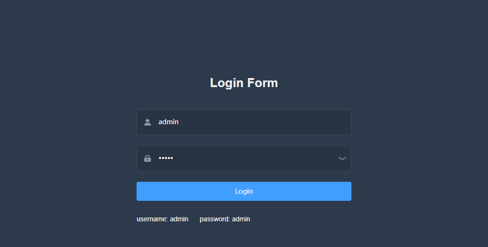
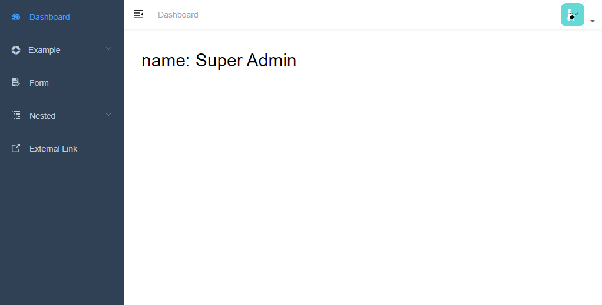
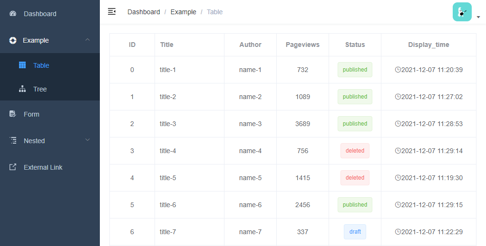

# wlua-demo

wlua demo

A demo for [wlua](https://github.com/hanxi/wlua)

## Try in docker

```bash
docker run -p 2888:2888 -d hanxi/wlua-demo:master
```

See website in browser <http://localhost:2888> .

## Run this demo local

Install wlua see [hanxi/wlua#readme](https://github.com/hanxi/wlua#readme) .

```bash
git clone git@github.com:hanxi/wlua-demo.git
cd wlua-demo
git sumodule update --init
wlua start
tail -F log/wlua.log
```

## HTTP API

Front web fork from <https://github.com/PanJiaChen/vue-admin-template/> , see https://juejin.cn/post/6844903476661583880 to learn how to use.

Use wlua implement this apis:

- /user/login [POST]
- /user/logout [POST]
- /user/info [GET]
- /table/list [GET]

Api code in `app/routes/user.lua` and `app/routes/table.lua` .


## Screenshots






